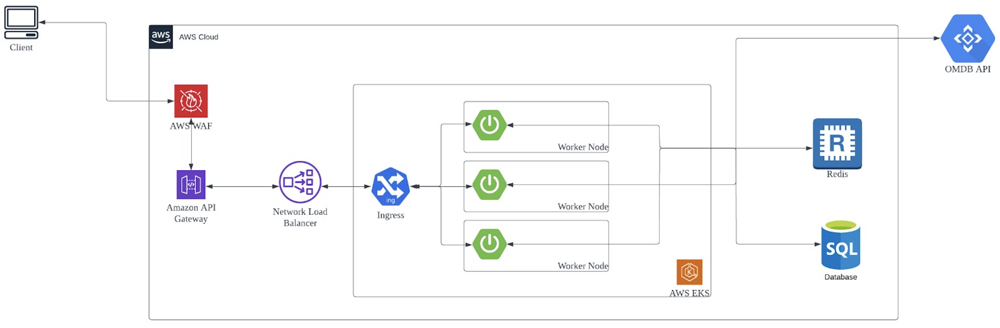

# movie-api

In order to sustain a load of 10000000 per day, we might want to make the following modification.

1. Need to use external database with higher IOPS support. Good if we can use database like postgresSQL/Maria DB hosted on AWS, so we dont have to worry about managing and scaling.
2. Need to use external distributed caching for storing the OMDB response. We can use AWS elasticache (Redis in cluster mode)
3. We can use end-2-end reactive stack, in currect app DB driver is not reactive. Hence having r2dbc would make the Database calls unblocking.
4. Instead of using embedded tomcat, should use netty.
5. Having a DB connection pool at application side would be good as well.
6. We can deploy the application in kubernetes. AWS EKS can be used here.
7. We can have a highly available NLB fronting the EKS.
8. Since traffic is very high at movie api, we can segregate auth component from this app which will be responsible only for User validation/Access token creation and validation.
9. We can also introduce API gateway to perform the orchestation infront of the movie app, having an api gateway helps to offload the cross-cutting functionality if we need (such as rate limiting and quota). We can use lightweight spring gateway/ aws API gateway for this. 
10. We can protect our entire solution with from various attacks using a WAF. AWS Cloud front or Imperva can be used here.

