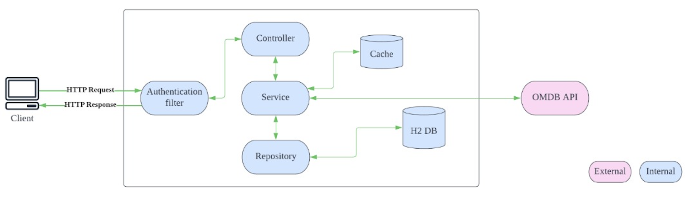

# movie-api

This application uses springboot with web-flux, trying to make the movie APIs reactive. It follows the general and simple folder structures.

This application serves the below functionality:

* Authentication of end user is done by calling /v1/api/login and provides JWT token (Access token) in return.
* Access token needs to be provided in header for accessing all other movie API.
* All APIs take UUID (used in request logging, for tracing purpose)
* After successful login, end user needs to perform the following using exposed rest API's
* Also attached here the postman bundle movie-api.postman_collection.json
* Exposes API to Check if a movie won oscar or not, by providing the movie name and year of release as input
* Exposes API to store/update user movie rating .
* Provides a list of 10 top-rated movies ordered by box office value.

For this solution we have used H2 databases(in-memory). The database schema and data gets initialised with the help of JPA and the seed sql queries.
Spring caching feature is also used here to avoid additional omdb api call, considering the omdb responses are not changing in real time. Hence, it is considered safe to be cached at application level.

